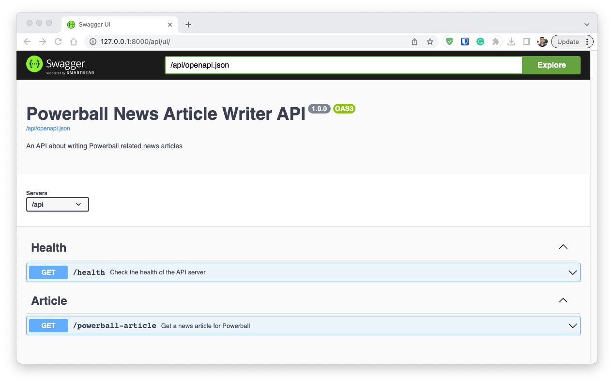
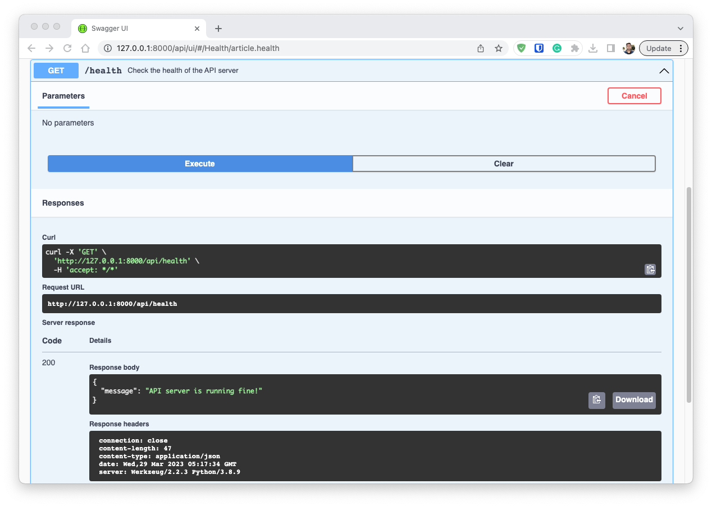
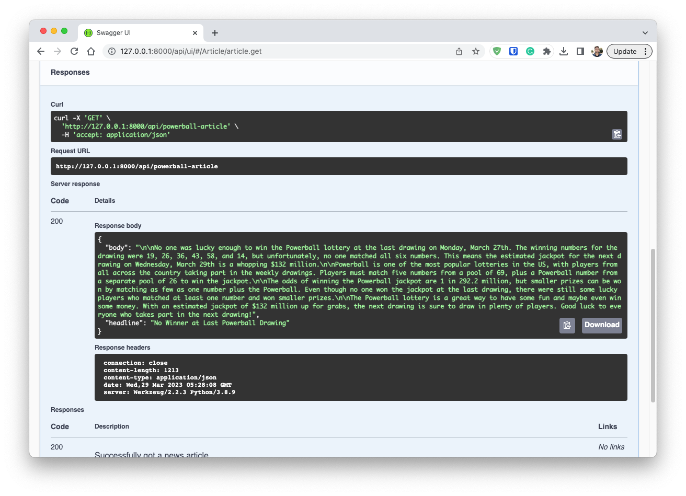
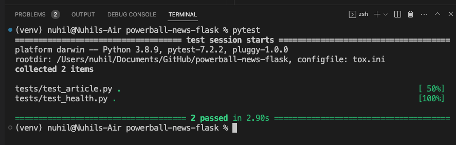
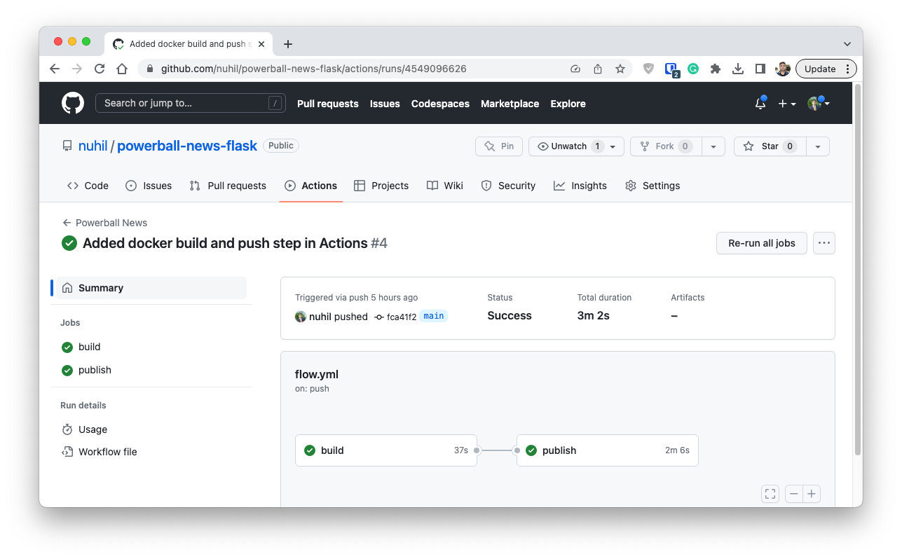

# Powerball News Article Generator
This repository contains a Python Flask based API server that can generate recurring news articles based on latest Powerball lottery information and OpenAI's GPT-3 API (optionally). The whole application is essentially built into a Docker image running which can start the API server as Docker container. This is the quickest way to try the APIs.

## 1. Installation
You can follow either of the following strategies to try the API.
* **Docker based Serving**
    1. Make sure your machine has [Docker](https://www.docker.com/) installed in it.
    2. Use the below command to pull and run the Docker image that contains the API application:
    ```sh
    docker run -d -p 8000:8000 -e OPENAI_API_KEY='xx-XXXX' nuhil/powerball-news-flask:latest
    ```
    The above command will first pull the Docker image (if not previously pulled in your local machine) and run it as a container. It also maps the host machine's port `8000` to the Docker container's port `8000`. This is because the Flask app running inside the container runs a webserver and listen to this port. You also need to pass an environment variable named `OPENAI_API_KEY` which is used by the app to generate articles using OpenAI's API. It is a good practice not to share Keys and Passwords through codebase/scripts. No worries, the API key was already shared with you via the Email from me. At the end of the command you have to use `nuhil/powerball-news-flask:latest` as the image name and tag which is already stored in Docker Hub.  

* **Serving from Local Environment**
    1. Make sure your machine has [Python](https://www.python.org/) (>= 3.7) installed in it.
    2. Clone the git repository (containing the source code of the app) into you local machine, using the following command:
    ```sh
    git clone https://github.com/nuhil/powerball-news-flask.git
    ```
    3. Get into the directory and install the Python dependencies using the following commands:
    ```sh
    cd powerball-news-flask
    pip install -r requirements.txt
    ```
    The `requirements.txt` file is already inside the repository you just cloned.  
    4. To run the Flask app, in other words the API server, use the below command:
    ```sh
    python app.py
    ```
    This should start the API server in development mode.  
    5. In another terminal, make sure you add an environment variable to your shell/system using the following command:
    ```sh
    export OPENAI_API_KEY=xx-XXXX
    ```

## 2. Usage
You can consume the APIs using any kind of client that is able to make typical REST (HTTP) calls. As of now, the endpoints are not yet configured to restrict unauthorized request (e.g., JWT). Therefore, playing with the API is as simple as below:

* **Using the built-in Swagger UI**  
This app comes with a built-in Swagger UI from where you can try the endpoints without worrying about any client. Therefore, if you first install/start the API server (either in development mode or via Docker) and then open this URL http://127.0.0.1:8000/api/ui/ in your browser, you should see an UI like below:

Here you can see two API endpoints are available in this app. Both of them are GET request type. Calling the first one without any parameter simply let you know whether the API server is running fine or not. For example, if you click on the accordion icon (down arrow) of the first API, then click `Try it out` button, and finally click the `Execute` button, it will show the output like below:

Anyway, this is not the API we are interested in. Rather, lets try the second API endpoints `/powerball-article`. This endpoint optionally accepts a query parameter named `use_ai` which defaults to `True`. So, if you simply call this endpoint, it should return a news article (in JSON format) generated/written by OpenAI's API, based on the latest Powerball drawing. Below is a screenshot of a successful call.

If you notice on the above screenshot, There is section called `Curl` under which the Swagger UI is showing you the `CURL` equivalent command which you can use by your own, independent of this UI, may be from inside your Terminal.
```sh
curl -X 'GET' \
  'http://127.0.0.1:8000/api/powerball-article' \
  -H 'accept: application/json'
```
* **Using Your Own Style**  
As just mentioned above, you can also use any client such as CURL, Postman, Browser addressbar if you wish. So, lets try the `/powerball-article` endpoint using CURL but this time providing the optional parameter `use_ai=false`. Use the below command from a Terminal that has CURL available.

```sh
curl -X 'GET' \
  'http://127.0.0.1:8000/api/powerball-article?use_ai=false' \
  -H 'accept: application/json'
```
You should get an ouput like below:
```sh
{
  "body": "No one won the Powerball jackpot at the last drawing on Mon, Mar 27, 2023.The winning numbers for the draw were 19 26 36 43 58 14, but no one was able to match them all correctly. \n\nThe next Powerball drawing will be on Wed, Mar 29, 2023, and the estimated jackpot is $132 Million.Players have a chance to win big if they can correctly match all five numbers plus the Powerball number.",
  "headline": "No One Wins Powerball Jackpot at Last Drawing"
}
```
This time the AP also wrote an article and used latest Powerball drawing information but the surrounding sentences are static meaning, if you pass the param `use_ai=false` then it will fillup this exact same content but with latest drawing information that is pulled from the Powerball website in realtime. Needless to say, if you use `use_ai=true` it should create unique articles everytime you call the API endpoint.

## 3. Behind the Scene
In each API call, the app first parse the latest information of the Powerball draw from https://www.powerball.com/. The parsed information contains the **winning numbers**, **winners of all categories along with their location (if there is any)**, **estimated jackpot**, **last and next drawing dates**. Then it writes a news article either by the AI content generator or using a predefined template. Finally, it returns a JSON object as the response.

## 4. Tools
1. [Flask](https://flask.palletsprojects.com/en/2.2.x/) micro web framework as the base application.
2. [Connexion](https://connexion.readthedocs.io/en/latest/index.html) with the added support for [Swagger UI](https://swagger.io/tools/swagger-ui/) to make use of auto-generated API documentation. 
    >Connexion is a spec-first Python web framework that automatically provides functionality based on an OpenAPI (or swagger) specification.
    
    Following [OpenAPI specification](https://www.openapis.org/) has many benefits one of which is standardization. OpenAPI specification provides a standard way to describe the API, making it easy for developers to understand and use the API.
3. [Selenium](https://selenium-python.readthedocs.io/) is used to scrap the Powerball website because of the following reasons:  
    3.1 Using Python's `requests` module may seem to be an easy alternative but the truth is, the Powerball website sometimes restrict the scrapper and send encoded content that is impossible to decode.  
    3.2 It prevents such robot calls even if you set custom headers like `User-Agent`. This is complete **uncertainity**.  
    3.3 Therefore, this app uses Selenium along with browser driver in headless mode. Don't worry, this setup is done inside the docker image as part of the image build process.  
    3.4 This gives consistent, concrete, and certain outcomes from the Powerball scrapper without any fear of being restricted.
4. [OpenAI](https://platform.openai.com/) API is used for dynamically generate unique and engaging articles based on the drawing information. As mentioned already, you can choose whether to use such generator or not.
5. [Docker](https://www.docker.com/) for containerization. 

## 5. Testing 
This app uses [pytest](https://docs.pytest.org/en/7.2.x/) to conduct the unit and integration testing in a very basic format. As of now, it covers two important test cases i) testing the health of the API server ii) testing the article generator. More tests could be added later. 


## 6. CI/CD
Since the codebase is hosted into Github, it makes the best use of Github Actions as the CI/CD workflow. As of now, the workflow is setup in the following way:  

1. If there is a push or pull request to the main branch, it triggers the Github Actions workflow.
2. The workflow first checkout the repository, build/install the dependencies, and test the application using pytest.
3. Then if tests are passed, it build the docker image, tag it as `latest`, and push it to the [Docker hub](https://hub.docker.com/repository/docker/nuhil/powerball-news-flask/general) account which is under my name.  

You can see a history of the CI/CD process in the below screenshot:

